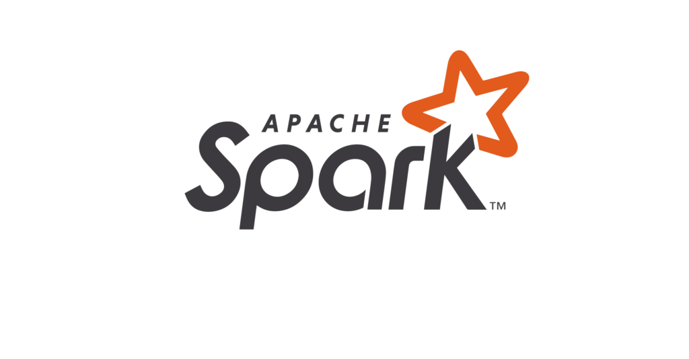

<b>Hi there 👋</b>
 
I'm <b>Elliot</b>, developer from France 🇫🇷! I'm a student, in my second year of my <i>Computer Science Master</i>, majoring in Data Engineering. I love programming <i>backend architectures</i>, <i>working with Big Data</i> and <i>tackling engineering challenges</i>. For the past 7 years, I've been learning different programming languages and technologies: mainly <b>Typescript</b>, <b>Java</b> and <b>Python</b>, but also <b>Scala</b>, <b>Go</b>, <b>Swift</b>, <b>C++</b>…
 
 
I also have experience with many modern technologies, such as <b>SQL & NoSQL</b>, <b>Apache Spark/Hadoop/Hive</b>, <b>CI/CD</b>, <b>Docker</b>, <b>AWS</b>, <b>Terraform</b>, <b>gRPC/REST/GraphQL</b>, <b>web frameworks</b>, and I'm always looking to learn more!
I'm mainly interested in Back-End development and Big Data Engineering.
 
 

___

<h3 align="center">My projects</h3>

   

Some of my biggest projects are unfortunately not open-source as they are developed as part of a startup I'm creating. However, I do like open-source very much, I have some projects available below, and I've also give back to open-source through [meaningful contributions](https://github.com/pulls?q=sort%3Aupdated-desc+is%3Apr+author%3A%40me+archived%3Afalse+-user%3ASkript-MC+-user%3AGalinaMak+-user%3AFyllee+-user%3Anoftaly+-user%3AErikCH) when I see room for improvements in a tool I use!

	

___

<h3 align="center">Technologies I master</h3>

&nbsp;

&nbsp;

&nbsp;

&nbsp;

&nbsp;

&nbsp;

&nbsp;

&nbsp;

&nbsp;

&nbsp;

<h3 align="center">Technologies I know well</h3>

&nbsp;

&nbsp;

&nbsp;

&nbsp;

&nbsp;

<h3 align="center">Technologies I've used or I use occasionally</h3>

&nbsp;

&nbsp;

&nbsp;

&nbsp;

