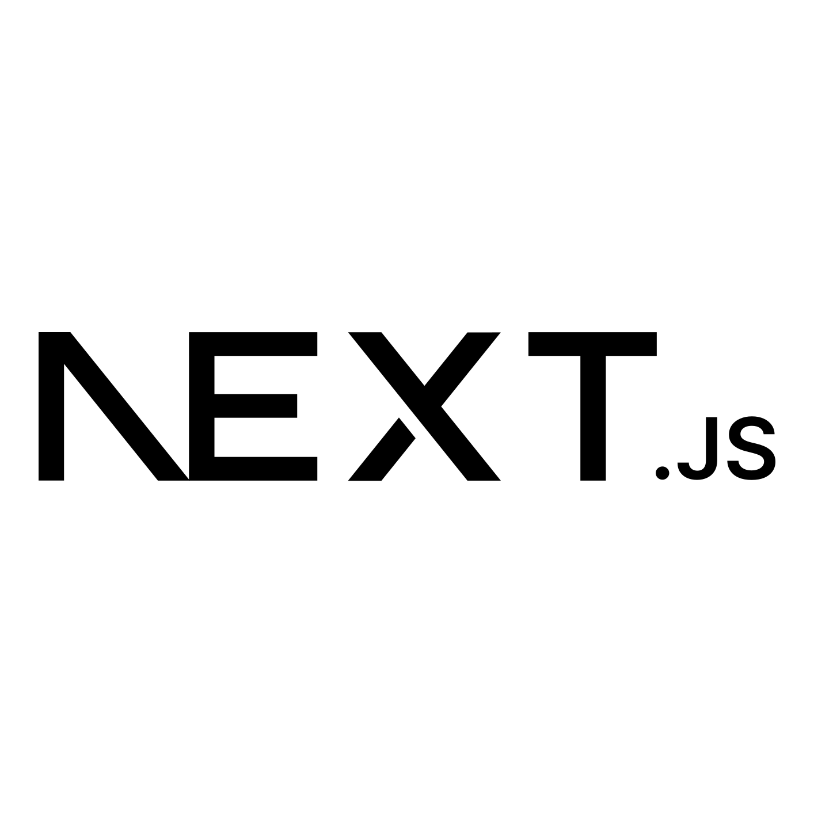
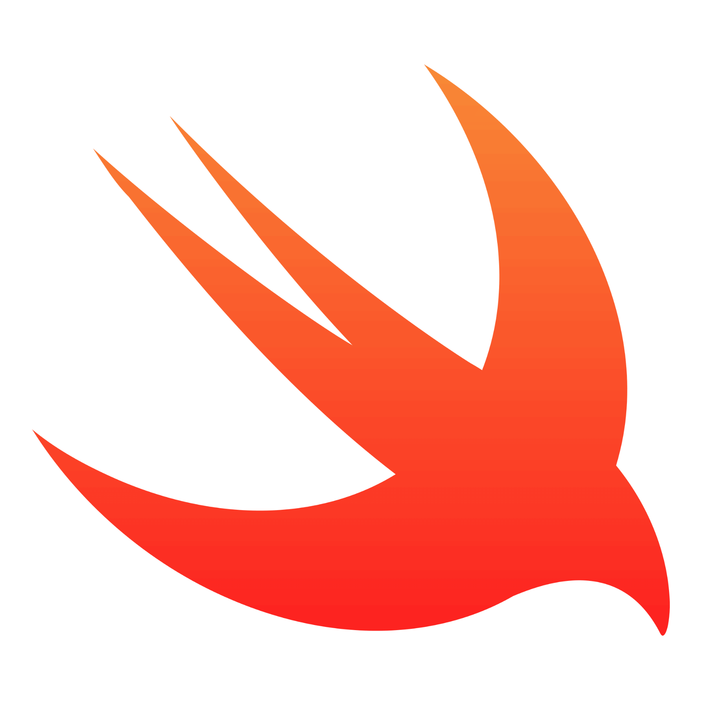
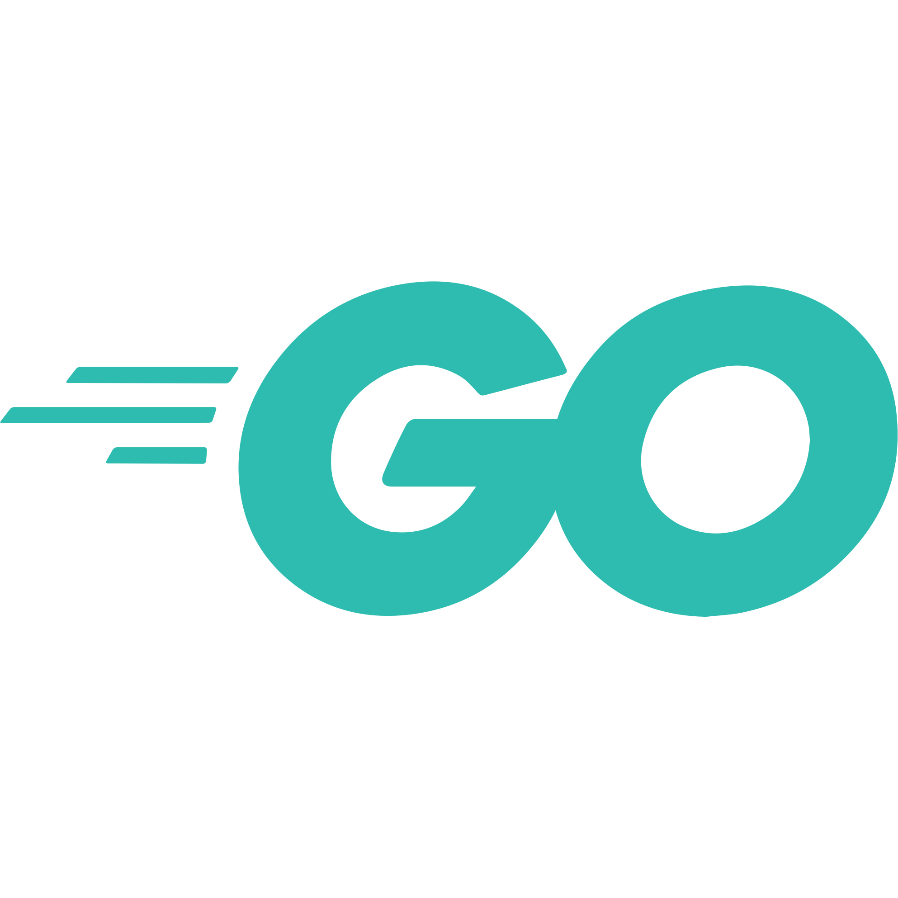

<b>Hi there 👋</b>

 
I'm <b>noftaly</b>, <u>developer</u> from France 🇫🇷! I'm a <b>student</b>, in my first year of my <i>Computer Science Master</i>. I love programming <i>websites</i> (mostly backends), <i>applications</i> and <i>algorithms</i>. Since 4 years, I'm constantly learning different programming languages and technologies: mainly <b>Javascript</b>, <b>Typescript</b> and <b>Python</b>, but also <b>Swift</b>, <b>Unity3D & C#</b>, <b>Go</b>, <b>C</b>...
  

___

	
		<b>My projects</b>
	
	 
	 
	 
	
	
	
	

___

	
		<b>Technologies I use</b>
	

	
	&nbsp;&nbsp;&nbsp;&nbsp;&nbsp;
	
	&nbsp;&nbsp;&nbsp;&nbsp;&nbsp;
	
	&nbsp;&nbsp;&nbsp;&nbsp;&nbsp;
	
	&nbsp;&nbsp;&nbsp;&nbsp;&nbsp;
	
	&nbsp;&nbsp;&nbsp;&nbsp;&nbsp;
	
	&nbsp;&nbsp;&nbsp;&nbsp;&nbsp;
	
	&nbsp;&nbsp;&nbsp;&nbsp;&nbsp;
	

	
		<b>Technologies I tried</b>
	

	
	&nbsp;&nbsp;&nbsp;&nbsp;&nbsp;
	
	&nbsp;&nbsp;&nbsp;&nbsp;&nbsp;
	
	&nbsp;&nbsp;&nbsp;&nbsp;&nbsp;
	

