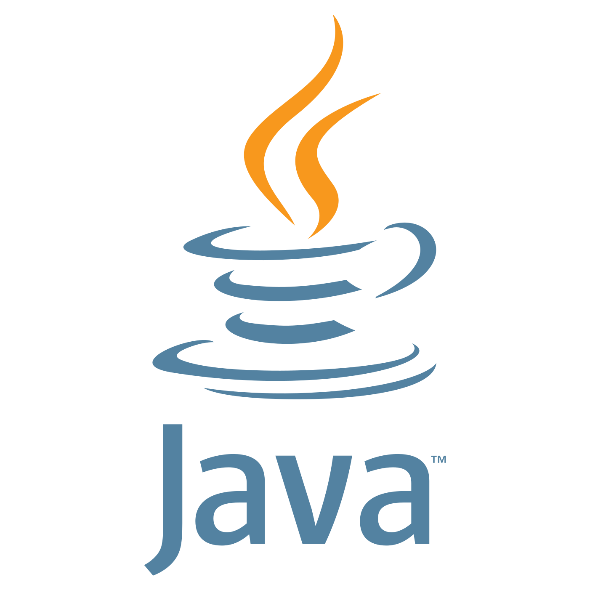

<b>Hi there 👋</b>
 
I'm <b>Elliot</b>, <u>developer</u> from France 🇫🇷! I'm a <b>student</b>, in my third year of my <i>Computer Science Master</i>. I love programming <i>websites</i> (mostly backends), <i>applications</i> and <i>algorithms</i>. Since 5 years, I'm constantly learning different programming languages and technologies: mainly <b>Javascript</b>, <b>Typescript</b> and <b>Python</b>, but also <b>Swift</b>, <b>Unity3D & C#</b>, <b>Go</b>, <b>C</b>, <b>Java</b>...
 
 

___

<h3 align="center">My projects</h3>

 
⭐️ ⭐️ ⭐️  🎉  ⭐️ ⭐️ ⭐️
  

 
 

___

<h3 align="center">Technologies I use everyday</h3>

&nbsp;

&nbsp;

&nbsp;

&nbsp;

&nbsp;

&nbsp;

&nbsp;

&nbsp;

<h3 align="center">Technologies I've tried</h3>

&nbsp;

&nbsp;

&nbsp;

&nbsp;

&nbsp;

&nbsp;

&nbsp;

&nbsp;

&nbsp;

&nbsp;

