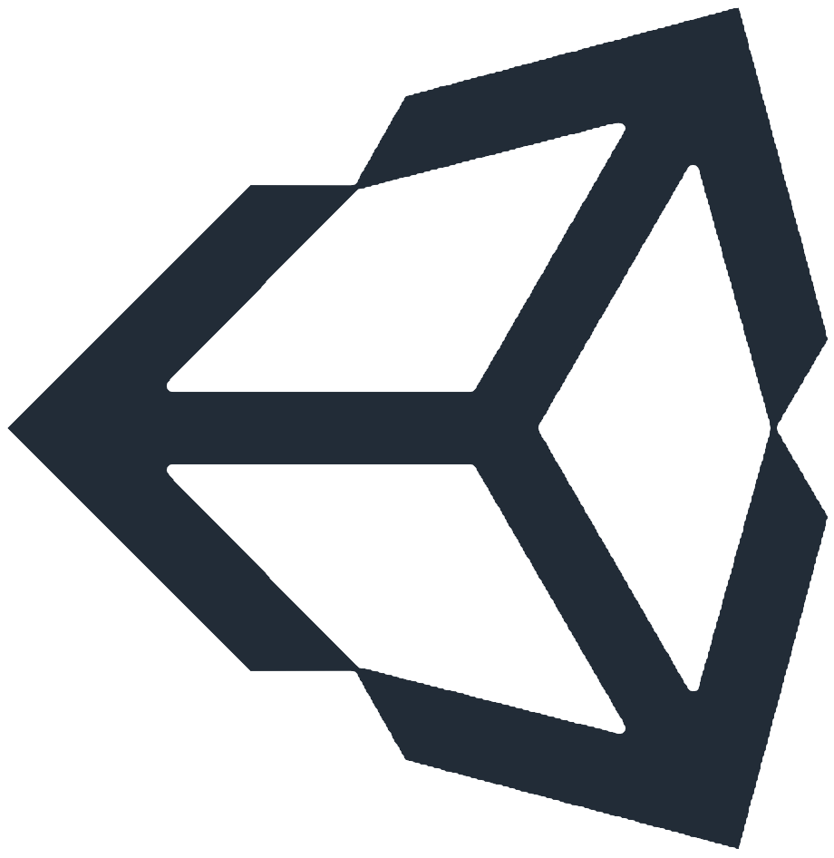

<b>
Hi there 👋
</b>

 
I'm <a href="https://nessmc.fr">noftaly</a>, <b>developer</b> from France :flag_fr:! I love programming websites (mostly backend), applications and algorithms. Since 4 years, I'm constantly learning different programming languages and technologies like <b>Javascript</b>, <b>Typescript</b>, <b>Python</b>, <b>Unity3D & C#</b>...

___

	 
	 
	 
	
	 
	 
	 
	
		<b>
			My projects
		</b>
	
	 
	 
	 
	
	
	
	
	

___

	
		<b>
		Technologies I use
		</b>
	

	
	&nbsp;&nbsp;&nbsp;&nbsp;&nbsp;
	
	&nbsp;&nbsp;&nbsp;&nbsp;&nbsp;
	
	 
	 
	
	&nbsp;&nbsp;&nbsp;&nbsp;&nbsp;
	
	&nbsp;&nbsp;&nbsp;&nbsp;&nbsp;
	
	  
	

